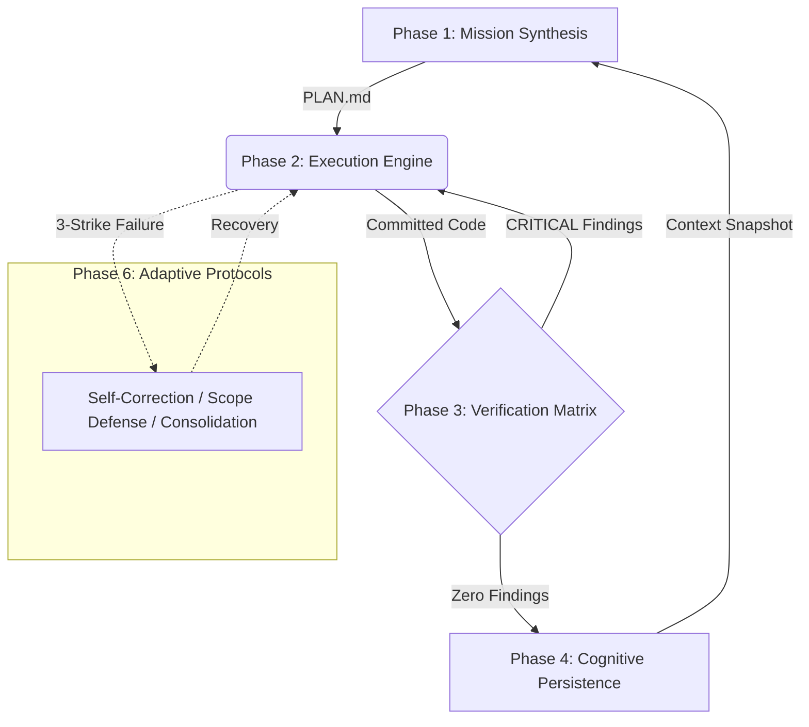

<div align="center">

*If this framework saves your agent from a doom loop, consider leaving a star!*
  
# Agent Rigor

**Strict engineering discipline for your AI coding assistant.**

[](https://opensource.org/licenses/MIT)
[](http://makeapullrequest.com)
[](#supported-agents)
[](https://github.com/MeherBhaskar/agent-rigor/commits/main)

*Stop watching your AI agent code itself into a corner. Bake software engineering best practices directly into its workflow.*


[Why Agent Rigor?](#why-agent-rigor) •
[Scientific Validation](#scientific-validation-rigorbench) •
[Quickstart](#quickstart) •
[Architecture](#architecture) •
[Supported Agents](#supported-agents)

</div>

---

## Table of Contents

- [Why Agent Rigor?](#why-agent-rigor)
- [Scientific Validation (RigorBench)](#scientific-validation-rigorbench)
- [Core Philosophy](#core-philosophy)
- [Architecture](#architecture)
- [The 6 Operational Phases](#the-6-operational-phases)
- [Quickstart](#quickstart)
- [Supported Agents](#supported-agents)
- [Documentation](#documentation)
- [Contributing](#contributing)
- [License](#license)

---

## Why Agent Rigor?

Most AI coding agents fail not because they lack intelligence, but because they lack **engineering discipline**. When left to their own devices, agents typically:
- Skip planning and jump straight to implementation.
- Write plausible-looking code that doesn't actually work or handle edge cases.
- Get trapped in "doom loops" (fix-forward spirals) instead of backing out of bad approaches.
- Forget what they learned between sessions (context amnesia).
- Suffer from "context rot" by loading too many instructions at once.

**Agent Rigor solves this.** It is a framework of specialized Agent Skills (folders of instructions, scripts, and resources) that forces your AI to adopt mature software engineering practices. It provides a modular, skill-based architecture: a set of mandatory instructions, verification gates, and anti-rationalization safeguards that ensure empirical discipline at every step.

If you want your agent to write code like a senior engineer rather than a junior hacker, Agent Rigor is the framework you need.

---

## Evaluation against RigorBench

Agent Rigor isn't just a collection of good ideas; it improves both process and outcomes.

According to **RigorBench**, the first benchmark to evaluate the *process discipline* of autonomous AI coding agents alongside their final outputs, Agent Rigor significantly outperforms baseline approaches.

### Methodology
While traditional benchmarks only measure whether a final test passes, RigorBench evaluates the full execution trajectory of an agent across 5 pillars of software engineering discipline:
1. **Planning Fidelity:** Does the agent formulate and follow an explicit, well-decomposed plan?
2. **Verification Coverage:** Does the agent write tests to verify its own output before declaring success?
3. **Recovery Efficiency:** Can the agent recover from errors without entering token-wasting doom loops?
4. **Abstention Quality:** Does the agent know when to stop and ask for help on impossible/ambiguous tasks?
5. **Atomic Transition Integrity:** Does the codebase remain in a healthy, building state between commits?

### Results
In a controlled study comparing state-of-the-art LLMs using different harnesses (Baseline ReAct, Superpowers, Agent-Skills, and Agent-Rigor) across 30 complex software engineering tasks:

| Metric | Baseline ReAct | Agent Rigor | Improvement |
| :--- | :--- | :--- | :--- |
| **Process Quality (RigorScore)** | 0.44 | **0.79** | **+41%** |
| **Outcome Quality (Success Rate)** | 0.64 | **0.83** | **+17%** |

> **Key Finding:** The study found a strong positive correlation ($r = 0.87$) between process discipline and final outcome quality. Better processes empirically lead to better code.

*Agent Rigor enforces the discipline that language models inherently lack, turning unpredictable token generation into a reliable software engineering pipeline.*

---

## Core Philosophy

1. **Actionable Protocols**: Every instruction is a verifiable step with exit criteria, not an essay.
2. **Empirical Sovereignty**: Claims require evidence. "Seems right" is never sufficient. Tests must pass.
3. **Atomic State Transitions**: The codebase moves between known-good states. Broken states are never committed.
4. **Anti-Rationalization**: Every skill actively anticipates and rebuts the excuses agents use to skip discipline (e.g., "This is a simple feature, I don't need to write tests").
5. **Skill-Based Modularity**: The agent dynamically triggers only the specific Agent Skills it needs for the current phase, saving context tokens and preventing instruction neglect.

---

## Architecture

The system is organized into a robust 3-tier hierarchy using **Agent Skills** to prevent context window collapse.

### The 3-Tier Context Hierarchy

1. **L1: Apex Kernel (`SYSTEM_CORE.md`)**: Always-on routing and non-negotiable laws.
2. **L2: Phase Directors (`00_PHASE_DIRECTOR.md`)**: Just-in-time orchestration loaded only when entering a phase.
3. **Agent Skills (`skills/*`)**: Folders containing a `SKILL.md` file with detailed execution guidelines, plus optional supporting resources and scripts, loaded *only* when requested by the Director.

### The Operational Loop



---

## The 6 Operational Phases

| Phase | Purpose | Key Skills |
| :--- | :--- | :--- |
| **01. Mission Synthesis** | Requirements & Planning | Requirement Distillation, Strategic Decomposition |
| **02. Execution Engine** | Implementation & Testing | Convergent Iteration, State Checkpointing |
| **03. Verification Matrix** | Quality & Review Gates | Pentagonal Audit, Entropy Reduction |
| **04. Cognitive Persistence** | Memory & Knowledge | Context Lifecycle, Structural Cartography |
| **05. Interface Protocols** | Safe Environment Interaction | Bounded Observation, Semantic Navigation |
| **06. Adaptive Protocols** | The Immune System | Recursive Self-Correction, Scope Containment |

---

## Quickstart

Get Agent Rigor working in your project in under 2 minutes.

### 1. Bootstrap Your Project

Run the installation script in your project root:

```bash
curl -sSL https://raw.githubusercontent.com/MeherBhaskar/agent-rigor/main/install.sh | bash
```
*(Alternatively, clone this repo into an `.agents/` directory).*

### 2. Tell Your Agent to Start
Simply prompt your agent with:
> "I need to build [feature]. Read `.agents/SYSTEM_CORE.md` and begin Phase 1 (Mission Synthesis)."

The agent will automatically read the Phase 1 Director, create a `PLAN.md`, and orchestrate its own work through implementation, review, and context saving.

---

## Supported Agents

Agent Rigor is pure markdown and **platform-agnostic**. It works natively with:

<div align="center">
  
| Agent / IDE | Integration Method |
| :--- | :--- |
| **Cursor** | Point to `.agents/SYSTEM_CORE.md` in your `.cursorrules` or `.mdc` files. |
| **Claude Code** | Include a reference in your `CLAUDE.md`. |
| **GitHub Copilot** | Reference in `.github/copilot-instructions.md`. |
| **Gemini CLI / Antigravity**| Include in `.agents/AGENTS.md`. |
| **Aider** | Pass via `--read .agents/SYSTEM_CORE.md`. |

*See the [`examples/`](./examples) folder for ready-to-use configuration templates.*

</div>

---

## Documentation

- [Quickstart Guide](QUICKSTART.md) — Step-by-step setup for any agent platform
- [Cheatsheet](CHEATSHEET.md) — Quick reference card for daily use
- [Context Management](CONTEXT_MANAGEMENT.md) — Understanding the skill-based modular architecture
- [Contributing](CONTRIBUTING.md) — How to add new skills and improve existing ones

---

## Contributing

We welcome contributions to make agents smarter and more disciplined! 
Please see our [Contributing Guidelines](CONTRIBUTING.md) to understand how to design skills that agents actually follow.

All participants are expected to uphold our [Code of Conduct](CODE_OF_CONDUCT.md).

---

## License

This project is licensed under the MIT License — see the [LICENSE](LICENSE) file for details.

---

<div align="center">

*If this framework saves your agent from a doom loop, consider leaving a star!*

</div>
