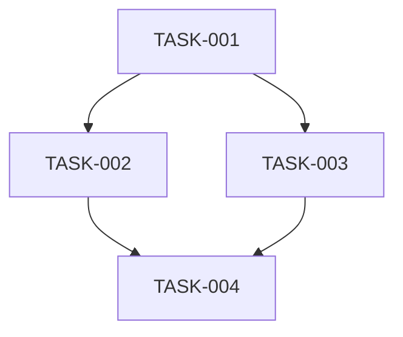

# Task Plan

> Generated by: [Agent/Human]
> Created: [YYYY-MM-DD HH:MM]
> Last Updated: [YYYY-MM-DD HH:MM]
> Status: [DRAFTING | ACTIVE | COMPLETED | ABANDONED]

## Objective

<!-- One-sentence description of what this plan accomplishes -->

## Scope Boundaries

### In Scope
- <!-- Explicitly list what IS included -->

### Out of Scope
- <!-- Explicitly list what is NOT included -->

## Assumptions

| ID | Assumption | Confidence | Verification Method |
|----|-----------|------------|-------------------|
| A1 | | HIGH/MEDIUM/LOW | |

## Dependency Graph

## Tasks

### TASK-001: [Title]
- **Depends on:** None
- **Status:** [PENDING]
- **Risk:** LOW | MEDIUM | HIGH
- **Acceptance Criteria:**
  - [ ] [Specific, testable condition]
  - [ ] [Another testable condition]
- **Files likely touched:**
  - `path/to/file.ext`
- **Notes:** <!-- Any context needed -->

---

### TASK-002: [Title]
- **Depends on:** TASK-001
- **Status:** [PENDING]
- **Risk:** LOW | MEDIUM | HIGH
- **Acceptance Criteria:**
  - [ ] [Specific, testable condition]
- **Files likely touched:**
  - `path/to/file.ext`
- **Notes:**

---

<!-- Add more tasks as needed -->

## Status Legend

| Marker | Meaning |
|--------|---------|
| `[PENDING]` | Not yet started |
| `[IN PROGRESS]` | Currently being worked on |
| `[DONE]` | Completed and verified |
| `[BLOCKED:<reason>]` | Cannot proceed until blocker is resolved |
| `[REVERTED]` | Was attempted but rolled back |

## Critical Path

<!-- List the sequence of tasks that determines the minimum completion time -->
TASK-001 → TASK-002 → TASK-004

## Risk Register

| Task | Risk | Mitigation |
|------|------|-----------|
| TASK-001 | | |
